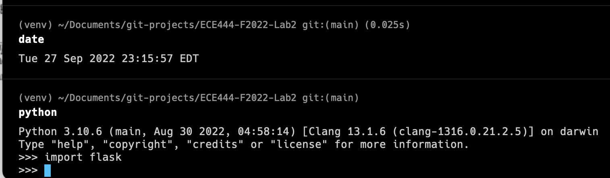
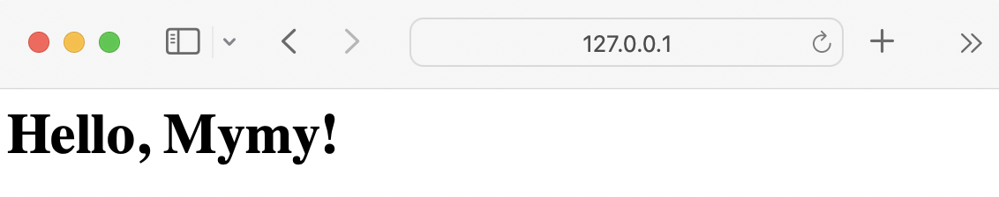
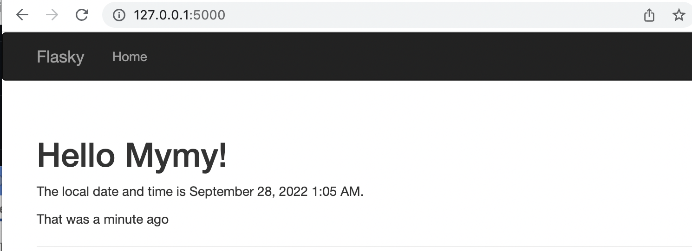
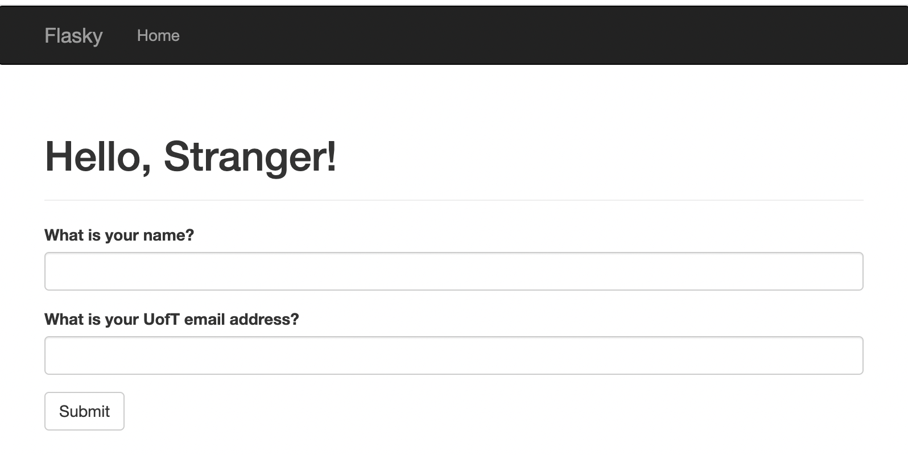
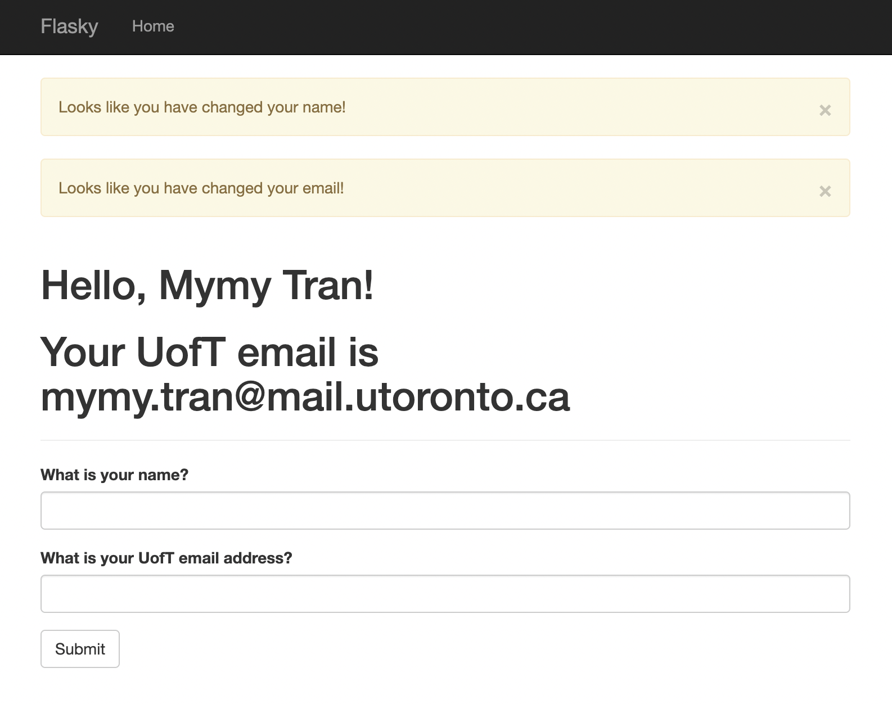
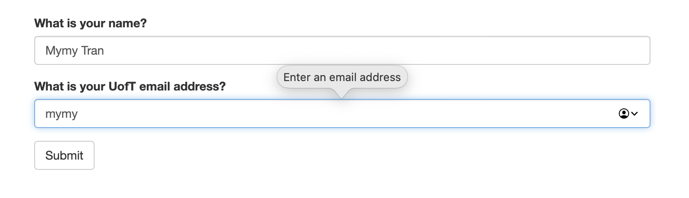
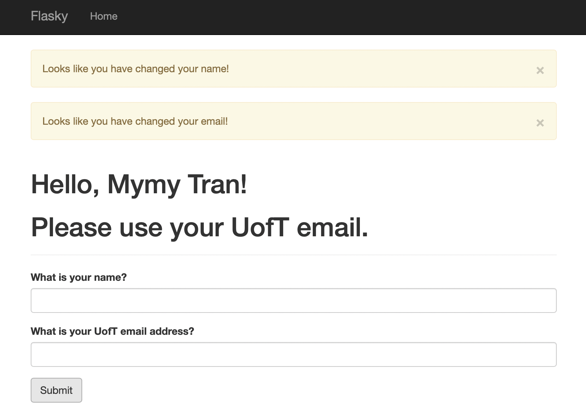

My My Tran
This repo is a clone of  https://github.com/miguelgrinberg/flasky.

# ECE444-F2022-Lab2
## Activity 1: Installation (1 point)

## Activity 2 (3 point): Creating a repo in your own GitHub account and replay the textbook example

## Activity 3 (3 point): Replay and modify example in Chapter 3 

## Activity 4 (3 point): Replay and modify example in Chapter 4

